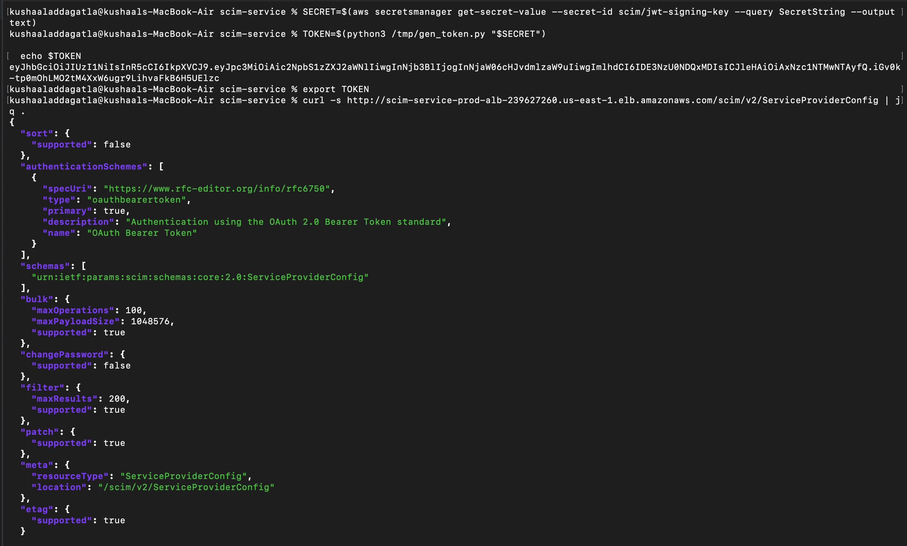
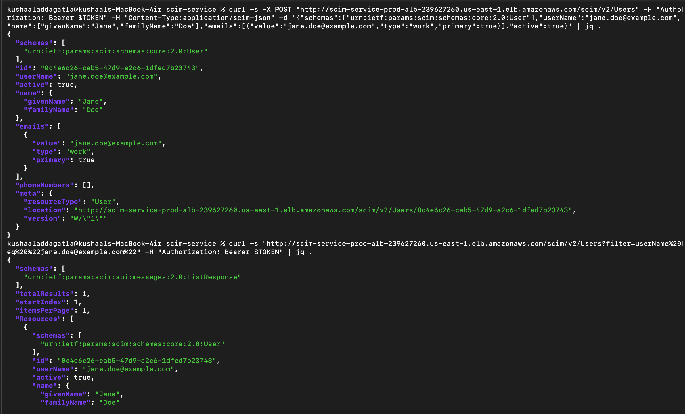
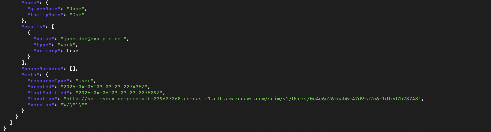
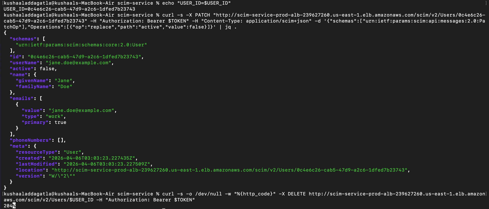
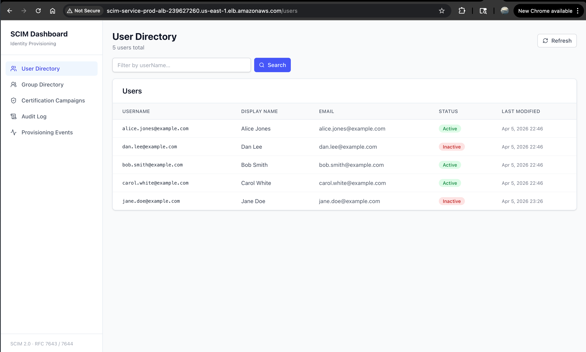

# SCIM-Compliant Identity Provisioning Service with Automated Access Lifecycle


| SCIM 2.0 (RFC 7643/7644) | Spring Boot | OAuth 2.0 / JWT | Access Certification | AWS ECS + SES | React |
|:---:|:---:|:---:|:---:|:---:|:---:|

---

## Overview

A fully SCIM 2.0 compliant user provisioning and deprovisioning service — the category of system enterprises pay Okta and SailPoint hundreds of thousands of dollars for. It acts as a SCIM server that any standard identity provider (Okta, Azure AD, or any SCIM 2.0 client) can connect to, automatically provisioning and deprovisioning users and groups across downstream applications.

Beyond provisioning, it implements an **access certification campaign engine** — the IGA (Identity Governance and Administration) capability that satisfies SOC2 CC6.3, HIPAA Minimum Necessary, and ISO 27001 periodic access review requirements. Stale access is flagged automatically, routed to managers for approve/revoke decisions, and fully audit-logged.

The full system is deployed on AWS ECS Fargate with a React dashboard (JWT-gated login) accessible via an Application Load Balancer.

---

## Architecture


---

## Tech Stack

| Component | Role & Detail |
|---|---|
| **Spring Boot 4.0.5** | SCIM 2.0 REST API — all standard endpoints per RFC 7643/7644. OAuth 2.0 + JWT Bearer token validation on all SCIM endpoints. |
| **PostgreSQL 16** | Identity store: users, groups, memberships, access history, certification records, full audit log (JSONB). Flyway-managed schema. |
| **React + TypeScript + Vite** | Dashboard with JWT-token login page, user directory, group directory, certification campaigns, audit log, and provisioning timeline. |
| **AWS ECS Fargate** | Containerized deployment for both API and React dashboard. Task definitions reference secrets by ARN via Secrets Manager. |
| **AWS ALB** | Path-based routing: `/scim/*` and `/api/*` → Spring Boot, `/` → React. |
| **AWS Secrets Manager** | JWT signing key storage. Loaded on startup via `AwsSecretsManagerConfig`. LocalStack in dev, real AWS in prod. |
| **AWS SES** | Certification campaign email delivery. Tokenized approve/revoke links with 7-day expiry, single-use enforcement. |
| **AWS CloudWatch** | Metrics and structured log streaming. Custom CloudWatch metrics for provisioning events and certification outcomes. |
| **Terraform** | Infrastructure as code. Manages ECS cluster, RDS, ALB, SES, Secrets Manager, CloudWatch log groups, ECR, and IAM roles. |
| **GitHub Actions** | CI/CD: build + test on push, Docker image push to ECR, ECS rolling deploy. |
| **Docker + docker-compose** | Local dev with PostgreSQL + LocalStack (S3, SQS, SES, Secrets Manager). |

---

## SCIM 2.0 Endpoints Implemented (RFC 7643 / RFC 7644)

```
# User endpoints
GET    /scim/v2/Users              # list users (pagination + filtering: ?filter=userName eq "john")
POST   /scim/v2/Users              # provision new user
GET    /scim/v2/Users/{id}         # get specific user
PUT    /scim/v2/Users/{id}         # full replace update
PATCH  /scim/v2/Users/{id}         # partial update — RFC 6902 JSON Patch
DELETE /scim/v2/Users/{id}         # soft-delete / deprovision

# Group endpoints
GET    /scim/v2/Groups             # list groups (pagination + filter support)
POST   /scim/v2/Groups             # create group with optional members
GET    /scim/v2/Groups/{id}        # get group with full members array
PATCH  /scim/v2/Groups/{id}        # add/remove members
DELETE /scim/v2/Groups/{id}        # delete group

# Discovery endpoints (required for IdP compatibility)
GET    /scim/v2/ServiceProviderConfig   # capability advertisement
GET    /scim/v2/Schemas                 # schema definitions
GET    /scim/v2/ResourceTypes           # resource type metadata

# Bulk (RFC 7644 §3.7)
POST   /scim/v2/Bulk               # bulk operations with bulkId forward-reference resolution
                                   # (enterprises need this for M&A: 500 users in one request)
```

**PATCH operations** use JSON Patch (RFC 6902) semantics — `add`, `remove`, `replace` on specific attribute paths including multi-valued filters like `emails[type eq "work"].value`. Both path-based and path-less PATCH forms are handled (Okta sends both).

---

## What's Built

### All steps complete

- **All 6 SCIM User endpoints** — `POST` (provision, 201 + Location header), `GET` by ID, `GET` list with pagination, `PUT` (full replace), `PATCH` (RFC 6902 JSON Patch), `DELETE` (soft delete, audit-safe)
- **All 5 SCIM Group endpoints** — `POST` (create with optional members), `GET` by ID (full members array), `GET` list with pagination + filter, `PATCH` (add/remove members), `DELETE`
- **SCIM Discovery endpoints** — `ServiceProviderConfig`, `Schemas`, `ResourceTypes` — required for Okta/Azure AD compatibility
- **JSON Patch (RFC 6902 + RFC 7644)** — fully implemented:
  - Path-based ops: `{ "op": "replace", "path": "active", "value": false }`
  - Path-less ops: `{ "op": "replace", "value": { "active": false, "name": { "givenName": "John" } } }`
  - Multi-valued attribute paths with filters: `emails[type eq "work"].value`
  - Okta path-less group PATCH for state sync
  - All three operations: `add`, `remove`, `replace` on scalar and multi-valued attributes
- **Bulk endpoint** — RFC 7644 §3.7 with `bulkId` forward-reference resolution (provision 500 users in one request; enterprises need this for M&A onboarding)
- **OAuth 2.0 / JWT Bearer auth** — all SCIM endpoints require a valid HS256 JWT with `scim:provision` scope. Discovery endpoints (`/ServiceProviderConfig`, `/Schemas`, `/ResourceTypes`) are public per RFC 7644 §4. Both 401 and 403 return `application/scim+json` — Okta rejects Spring's default HTML error pages.
- **JWT signing key in Secrets Manager** — loaded on startup from LocalStack (local profile) or real AWS (prod). Key never appears in application config.
- **Rate limiting** — Bucket4j token bucket, 100 req/min per source IP. Real IP resolved from `X-Forwarded-For` for proxied requests.
- **ETag / Optimistic Concurrency** — `meta.version` as weak ETag (`W/"1"`), `If-Match` on PUT/PATCH rejects stale writes with 412 Precondition Failed.
- **SCIM Filtering** — `?filter=userName eq "john"`, `?filter=emails.value eq "john@example.com"`, supports `userName`, `externalId`, `active`, `emails.value` via JPA Specifications
- **Pagination** — 1-based `startIndex` per SCIM spec, `count` parameter, response includes `totalResults`, `startIndex`, `itemsPerPage`, `Resources`
- **SCIM-compliant error responses** — all errors return `application/scim+json` with `ScimError` DTO. 400 for malformed PATCH, 401/403 for auth, 404 for not found, 409 for uniqueness conflicts, 412 for ETag mismatch, 429 for rate limit
- **Audit logging** — every SCIM operation writes to `audit_log` with event type, actor, target user, raw SCIM operation (JSONB), outcome, source IP, and correlation ID
- **Correlation ID tracing** — `CorrelationIdFilter` generates/reads `X-Correlation-ID`, propagates via MDC to all audit log entries and structured logs
- **CloudWatch metrics** — custom metrics published for provisioning events and certification outcomes via `CloudWatchMetricsService`
- **Flyway-managed schema** — `ddl-auto: validate`, 6 numbered migrations (users + emails + phones, seed data, groups, certification tables, manager FK, access history seed)
- **Integration tests** — Testcontainers with real PostgreSQL, covering all endpoints, error cases, ETag flows, PATCH operations, filter queries, pagination, JWT auth, rate limiting, and certification flows
- **Unit tests** — service layer with mocked repositories; email service, token service, escalation scheduler
- **CI/CD pipeline** — GitHub Actions: test → ECR build/push → ECS rolling deploy on every push to main
- **Access certification engine** — see section below
- **React dashboard** — see section below
- **Terraform + ECS deployment** — see section below

---

## Access Certification Engine

The certification engine is what elevates this from "SCIM server" to "IGA platform." It satisfies SOC2 CC6.3 (periodic access reviews) and HIPAA Minimum Necessary access controls.

### How it works

```
Week 1, Monday 1am  ─── CertificationScheduler runs
                          │  Finds access_history rows with last_accessed_at < 90 days ago
                          │  Creates PENDING certification record, mints single-use review token
                          └─ Sends tokenized email to manager (approve / revoke links via SES)

                              Manager clicks Approve → status = APPROVED, audit log written
                              Manager clicks Revoke  → status = REVOKED, user deactivated, audit log written

Week 2, Tuesday 2am ─── EscalationScheduler runs (nightly sweep)
                          │  Finds PENDING certifications with expires_at < NOW()
                          │  No response in 7 days → treat as revocation (fail-secure)
                          │  Sets status = EXPIRED
                          │  Fires internal PATCH: active = false (same path as explicit revoke)
                          └─ Writes CERTIFY_ESCALATE audit log entry with expires_at for SOC2 evidence
```

### Security properties of the token design

- **Raw token never stored** — only `SHA-256(rawToken)` is written to the database as `token_hash`. A database breach cannot reconstruct working review links.
- **Single-use** — `token_used = true` is written before the decision is applied. A transient failure after the token is burned leaves the token consumed.
- **7-day expiry** — the JWT `exp` claim and `expires_at` column enforce the deadline independently.

### Fail-secure principle

> Silence == revoke. If a manager does not respond within 7 days, access is automatically suspended.

Most systems default to fail-open (non-response preserves access). This project inverts that — the absence of an explicit approval is treated as a revocation, matching a firewall's default-deny rule. This closes the SOC2 CC6.3 gap: every access record is either explicitly approved or automatically suspended.

---

## React Dashboard

A React + TypeScript + Vite single-page application deployed to ECS Fargate alongside the API, served via ALB path routing.

**Pages:**
- **Login** — JWT token entry page. Paste a Bearer token to authenticate; the token is stored in `localStorage` and attached to every API request as `Authorization: Bearer <token>`.
- **User Directory** — full user list with username, display name, email, active/inactive status badge, and last modified timestamp. Filter by username.
- **Group Directory** — group list with member counts.
- **Certification Campaigns** — active and closed access certification campaigns with approve/revoke action links.
- **Audit Log** — searchable and filterable log of all SCIM operations and certification decisions.
- **Provisioning Events** — timeline view of provisioning and deprovisioning events.

---

## Infrastructure (Terraform + ECS)

Full infrastructure-as-code via Terraform:

| Resource | Detail |
|---|---|
| **ECS Fargate** | Two task definitions: `scim-service` (Spring Boot) and `scim-service-ui` (React/Nginx). |
| **RDS PostgreSQL** | Managed database in private subnet. Credentials in Secrets Manager, referenced by ARN in task definition. |
| **ALB** | Path-based routing: `/scim/*` and `/api/*` → API target group, `/` → UI target group. |
| **ECR** | Private container registry for both API and UI images. |
| **Secrets Manager** | JWT signing key, database credentials. |
| **SES** | Email sending for certification campaigns. |
| **CloudWatch** | Log groups for API and UI containers. Custom metric namespace for provisioning events. |
| **IAM** | Task execution roles with least-privilege policies. |

---

## Security Design

| Control | Implementation |
|---|---|
| **OAuth 2.0 + JWT** | All SCIM endpoints require a valid Bearer token with `scim:provision` scope. HS256 signature verification, expiry check, and issuer check on every request. Discovery endpoints public per RFC 7644 §4. |
| **Secrets Manager** | JWT signing key stored in Secrets Manager (LocalStack in dev, real AWS in prod). ECS task definition references secrets by ARN. Key never appears in application config. |
| **Tokenized cert links** | Approve/revoke links are short-lived JWTs (7-day expiry). Single-use — link is invalidated after first click. Prevents replay attacks. |
| **Token hash storage** | Only `SHA-256(rawToken)` stored in DB — raw token never persisted. |
| **Rate limiting** | SCIM endpoints rate-limited per source IP (100 req/min). Real IP resolved from `X-Forwarded-For`. |
| **Input validation** | SCIM schema validation on every inbound request. Malformed PATCH operations rejected with RFC-compliant 400. |
| **SCIM error format** | 401 and 403 responses return `application/scim+json` — Okta and other IdPs reject Spring's default HTML error pages. |
| **ETag concurrency** | `If-Match` on PUT/PATCH rejects stale writes (412), preventing lost-update race conditions. |

---

## Results / Demo

All screenshots captured against the live ECS deployment (Spring Boot API + React dashboard behind the ALB).

### Generate JWT token + ServiceProviderConfig

JWT minted from Secrets Manager via the `mint-local-token.sh` script, then used to query the `ServiceProviderConfig` discovery endpoint on the live ALB URL.



### Provision a user + list with filter

`POST /scim/v2/Users` provisions Jane Doe (201 + Location header). `GET /scim/v2/Users?filter=userName%20eq%20%22jane.doe@example.com%22` returns the filtered `ListResponse`.





### PATCH deactivate + DELETE deprovision

`PATCH /scim/v2/Users/{id}` with `{ "op": "replace", "path": "active", "value": false }` deactivates the user. `DELETE /scim/v2/Users/{id}` returns 204.



### React Dashboard

User Directory page showing 5 users (seed data + provisioned user) with active/inactive status badges. Deployed at the ALB `/` route. Login requires a valid JWT Bearer token.



### Swagger UI

Full interactive API documentation available at `/swagger-ui.html`.

[View Swagger UI PDF](docs/Swagger%20UI.pdf)

---

## Audit Trail & Compliance Logging

Every provisioning event, SCIM operation, certification decision, and access change is written to an immutable audit log in PostgreSQL and streamed to CloudWatch.

```sql
audit_log:
    timestamp          -- event time (UTC)
    event_type         -- PROVISION | DEPROVISION | CERTIFY_APPROVE | CERTIFY_REVOKE | SCIM_PATCH
    actor              -- system (SCIM IdP) or human (manager email)
    target_user_id     -- affected user
    resource_id        -- application or group affected
    scim_operation     -- raw SCIM request body (JSONB)
    outcome            -- SUCCESS | FAILED | PENDING
    source_ip          -- originating IP
    correlation_id     -- trace ID across distributed operations
```

---

## Quick Start

### Prerequisites

- **Java 21**
- **Docker** (for PostgreSQL + LocalStack via docker-compose, and Testcontainers in tests)
- **AWS CLI** (`brew install awscli`)
- **Python 3** (for the token minting script — uses stdlib only, no pip install)

### Run locally

```bash
# 1. Clone the repo
git clone https://github.com/KushaalAddagatla/scim-service.git
cd scim-service

# 2. Start PostgreSQL + LocalStack
docker-compose up -d

# 3. Seed the JWT signing key into LocalStack Secrets Manager
./scripts/dev-setup.sh

# 4. Build and run tests
./mvnw clean install

# 5. Start the application with the local profile
./mvnw spring-boot:run -Dspring-boot.run.profiles=local
```

The app starts on `http://localhost:8080` with seed data (4 users) pre-loaded via Flyway.

### Get a Bearer token

```bash
# Mint a 1-day token for curl testing
./scripts/mint-local-token.sh

# Export for use in your shell session
export TOKEN='<paste token here>'
```

### Try it

```bash
# Discovery — no token needed (RFC 7644 §4)
curl -s http://localhost:8080/scim/v2/ServiceProviderConfig | jq

# List all users
curl -s -H "Authorization: Bearer $TOKEN" \
  http://localhost:8080/scim/v2/Users | jq

# Provision a new user
curl -s -X POST http://localhost:8080/scim/v2/Users \
  -H "Authorization: Bearer $TOKEN" \
  -H "Content-Type: application/scim+json" \
  -d '{
    "schemas": ["urn:ietf:params:scim:schemas:core:2.0:User"],
    "userName": "jane.doe@example.com",
    "name": { "givenName": "Jane", "familyName": "Doe" },
    "emails": [{ "value": "jane.doe@example.com", "type": "work", "primary": true }],
    "active": true
  }' | jq

# Filter by userName (pre-check Okta runs before provisioning)
curl -s -H "Authorization: Bearer $TOKEN" \
  'http://localhost:8080/scim/v2/Users?filter=userName%20eq%20%22alice%22' | jq

# PATCH a user (RFC 6902 JSON Patch)
curl -s -X PATCH http://localhost:8080/scim/v2/Users/{id} \
  -H "Authorization: Bearer $TOKEN" \
  -H "Content-Type: application/scim+json" \
  -H 'If-Match: W/"1"' \
  -d '{
    "schemas": ["urn:ietf:params:scim:api:messages:2.0:PatchOp"],
    "Operations": [
      { "op": "replace", "path": "active", "value": false },
      { "op": "replace", "path": "emails[type eq \"work\"].value", "value": "new@example.com" }
    ]
  }' | jq

# List groups
curl -s -H "Authorization: Bearer $TOKEN" \
  http://localhost:8080/scim/v2/Groups | jq
```

### Run tests

```bash
# All tests (requires Docker for Testcontainers)
./mvnw test

# Single test class
./mvnw test -Dtest=ScimUserControllerIT
./mvnw test -Dtest=ScimUserPatchIT
./mvnw test -Dtest=ScimGroupControllerIT
./mvnw test -Dtest=ScimSecurityIT
./mvnw test -Dtest=CertificationIT
```

---

## Okta Integration Guide

### Setup

**1. Get a free Okta developer tenant**

Sign up at [developer.okta.com](https://developer.okta.com) — no credit card required.

**2. Expose your local server with ngrok**

```bash
ngrok http 8080
# Note the https forwarding URL, e.g. https://abc123.ngrok-free.app
```

**3. Mint a long-lived token for Okta**

```bash
./scripts/mint-local-token.sh 30   # 30-day token
```

**4. Create a SCIM app in Okta**

In your Okta admin console:
- Applications → Browse App Catalog → search "SCIM 2.0 Test App (Header Auth)"
- Provisioning → Integration tab:
  - SCIM connector base URL: `https://<your-ngrok-url>/scim/v2`
  - Unique identifier field: `userName`
  - Authentication mode: HTTP Header
  - Authorization: paste your Bearer token
- Enable: Push New Users, Push Profile Updates, Push Groups

**5. Test provisioning**

- Assign a user to the SCIM app in Okta → user appears in `scim_users` table
- Assign the user to an Okta group → group membership appears in `scim_group_memberships`
- Deactivate the user in Okta → PATCH fires with `{ "op": "replace", "path": "active", "value": false }`

---

## Project Structure

```
src/main/java/com/github/kushaal/scim_service/
├── controller/
│   ├── ScimUserController.java          # All 6 SCIM User endpoints
│   ├── ScimGroupController.java         # All 5 SCIM Group endpoints
│   ├── ScimDiscoveryController.java     # ServiceProviderConfig, Schemas, ResourceTypes
│   ├── ScimBulkController.java          # POST /scim/v2/Bulk — RFC 7644 §3.7
│   └── CertificationController.java     # Approve/revoke action endpoints for tokenized email links
├── service/
│   ├── ScimUserService.java             # Business logic, audit logging, ETag validation
│   ├── ScimGroupService.java            # Group CRUD, member add/remove, filter support
│   ├── ScimBulkService.java             # Bulk op orchestration with bulkId forward-reference resolution
│   ├── PatchApplier.java                # RFC 6902 JSON Patch engine
│   ├── CertificationService.java        # Certification campaign lifecycle
│   ├── CertificationScheduler.java      # Weekly stale access detection job
│   ├── EscalationScheduler.java         # Nightly fail-secure auto-suspend job
│   ├── CertificationEmailService.java   # SES email delivery with tokenized links
│   ├── CertificationTokenService.java   # Token minting, SHA-256 hash storage, single-use enforcement
│   └── CloudWatchMetricsService.java    # Custom CloudWatch metric publishing
├── repository/
│   ├── ScimUserRepository.java          # JPA + Specification queries
│   ├── ScimGroupRepository.java
│   ├── ScimGroupMembershipRepository.java
│   ├── AuditLogRepository.java
│   ├── CertificationRepository.java
│   └── AccessHistoryRepository.java
├── model/entity/
│   ├── ScimUser.java                    # Core user entity, UUID PK
│   ├── ScimUserEmail.java               # Multi-valued emails (@OneToMany)
│   ├── ScimUserPhoneNumber.java         # Multi-valued phone numbers (@OneToMany)
│   ├── ScimGroup.java                   # Group entity, UUID PK
│   ├── ScimGroupMembership.java         # Join table with composite PK
│   ├── ScimGroupMembershipId.java       # Composite PK embeddable
│   ├── AuditLog.java                    # Immutable audit log with JSONB operations
│   ├── Certification.java               # Certification campaign record
│   └── AccessHistory.java               # Per-user resource access tracking
├── dto/
│   ├── request/                         # ScimUserRequest, ScimGroupRequest, ScimPatchRequest,
│   │                                    # ScimPatchOperation, ScimBulkRequest, ScimBulkOperation
│   └── response/                        # ScimUserDto, ScimGroupDto, ScimListResponse, ScimMeta,
│                                        # ScimError, ScimBulkResponse, ScimBulkOperationResult
├── mapper/
│   ├── ScimUserMapper.java
│   └── ScimGroupMapper.java
├── filter/
│   ├── ScimFilterParser.java            # SCIM filter expression parser (eq operator)
│   ├── ScimUserSpecification.java       # JPA Specification for user dynamic WHERE clauses
│   └── ScimGroupSpecification.java
├── config/
│   ├── SecurityConfig.java              # OAuth 2.0 JWT resource server, scope enforcement
│   ├── AwsSecretsManagerConfig.java     # Loads JWT signing key from Secrets Manager on startup
│   ├── RateLimitFilter.java             # Bucket4j token bucket, 100 req/min per source IP
│   ├── CorrelationIdFilter.java         # X-Correlation-ID generation + MDC propagation
│   ├── CloudWatchConfig.java            # CloudWatch client bean configuration
│   ├── SesConfig.java                   # SES client bean configuration
│   └── OpenApiConfig.java               # Springdoc OpenAPI / Swagger UI config
└── exception/
    ├── ScimExceptionHandler.java        # Global handler → ScimError responses
    ├── ScimResourceNotFoundException.java
    ├── ScimConflictException.java
    ├── ScimInvalidValueException.java
    ├── ScimPreconditionFailedException.java
    ├── ScimTooManyRequestsException.java
    ├── CertificationTokenExpiredException.java
    └── CertificationTokenAlreadyUsedException.java

src/main/resources/db/migration/
├── V1__create_users_table.sql           # users, emails, phones, audit_log + indexes
├── V2__seed_data.sql                    # 4 demo users with realistic data
├── V3__create_groups_tables.sql         # groups, group memberships + indexes
├── V4__create_certification_tables.sql  # certifications, access_history tables
├── V5__add_manager_id_to_scim_users.sql # manager FK on scim_users
└── V6__seed_access_history.sql          # seed stale access records for cert demo

scim-service-ui/                         # React dashboard (separate repo / project)
├── src/pages/
│   ├── Login.tsx                        # JWT token entry page
│   ├── UserDirectory.tsx                # User list with status badges
│   ├── GroupDirectory.tsx               # Group list
│   ├── CertificationCampaigns.tsx       # Active/closed campaigns
│   ├── AuditLog.tsx                     # Searchable audit log
│   └── ProvisioningTimeline.tsx         # Provisioning event timeline
└── src/components/
    └── Layout.tsx                       # Sidebar navigation

terraform/
├── main.tf / variables.tf / outputs.tf
├── networking.tf                        # VPC, subnets, security groups
├── ecs.tf                               # ECS cluster, API task definition, service
├── frontend.tf                          # React UI task definition and service
├── rds.tf                               # RDS PostgreSQL instance
├── secrets.tf                           # Secrets Manager resources
├── ecr.tf                               # ECR repositories for API and UI images
├── iam.tf                               # Task execution roles and policies
├── cloudwatch.tf                        # Log groups and metric alarms
└── ses.tf                               # SES email sending configuration

scripts/
├── dev-setup.sh                         # Seed LocalStack Secrets Manager with JWT signing key
└── mint-local-token.sh                  # Mint a Bearer JWT for curl testing or Okta config

docs/
├── architecture.png
├── local-dev-guide.md
├── Swagger UI.pdf                       # Full Swagger UI endpoint documentation
└── screenshots/                         # Live demo screenshots (ECS deployment)
    ├── generate_jwt_token&service_provider_config.png
    ├── provision_a_user&list_users_with_filter.png
    ├── provision_a_user&list_users_with_filter-2.png
    ├── PATCH-deactivate&DELETE-deprovision_a_user.png
    └── react_dashboard.png
```

---

## Build Roadmap

| Step | Deliverable | Status |
|---|---|---|
| **Step 1** | SCIM User endpoints: GET list, POST provision, GET by ID, PUT, DELETE. PostgreSQL identity store with Flyway migrations. Seed data. | **Done** |
| **Step 2** | SCIM PATCH for Users — JSON Patch (RFC 6902) with multi-valued attribute paths, ETag/If-Match concurrency, SCIM filtering, pagination. | **Done** |
| **Step 3** | SCIM Group endpoints + PATCH for group membership. OAuth 2.0 / JWT protection on all endpoints. Rate limiting. | **Done** |
| **Step 4** | Okta developer tenant integration — real IdP provisioning users and groups end-to-end. | **Done** |
| **Step 5** | Access certification engine: stale access detection, PostgreSQL certification tables, SES email with tokenized approve/revoke links, fail-secure escalation scheduler. | **Done** |
| **Step 6** | React dashboard (JWT-gated login, user/group/cert/audit views) + Terraform + ECS Fargate deployment with ALB path routing. | **Done** |
| **Step 7** | Bulk endpoint (RFC 7644 §3.7 with bulkId forward-reference resolution), CloudWatch metrics, discovery endpoints, Swagger UI. | **Done** |
