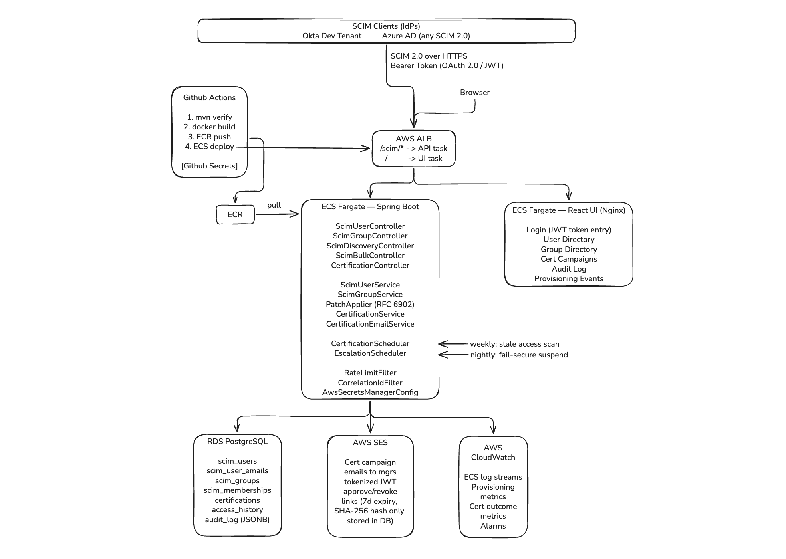

# SCIM-Compliant Identity Provisioning Service with Automated Access Lifecycle


| SCIM 2.0 (RFC 7643/7644) | Spring Boot | OAuth 2.0 / JWT | Access Certification | AWS ECS + SES | React |
|:---:|:---:|:---:|:---:|:---:|:---:|

---

## Overview

A fully SCIM 2.0 compliant user provisioning and deprovisioning service — the category of system enterprises pay Okta and SailPoint hundreds of thousands of dollars for. It acts as a SCIM server that any standard identity provider (Okta, Azure AD, or any SCIM 2.0 client) can connect to, automatically provisioning and deprovisioning users and groups across downstream applications.

Beyond provisioning, it implements an **access certification campaign engine** — the IGA (Identity Governance and Administration) capability that satisfies SOC2 CC6.3, HIPAA Minimum Necessary, and ISO 27001 periodic access review requirements. Stale access is flagged automatically, routed to managers for approve/revoke decisions, and fully audit-logged.

A free Okta developer tenant is connected as the live SCIM client, provisioning real users and groups end-to-end against this server.

---

## Architecture



---

## Tech Stack

| Component | Role & Detail |
|---|---|
| **Spring Boot** | SCIM 2.0 REST API implementation — all standard endpoints per RFC 7643/7644. OAuth 2.0 + JWT Bearer token validation on all SCIM endpoints. |
| **PostgreSQL** | Identity store: users, groups, memberships, provisioning events, access history, certification records, full audit log. |
| **AWS ECS** | Containerized deployment. Task definition references secrets by ARN via Secrets Manager — dogfooding the security pattern. |
| **AWS Secrets Manager** | JWT signing key storage. Loaded on startup via `AwsSecretsManagerConfig`. LocalStack in dev, real AWS in prod. |
| **AWS SES** | Certification campaign email delivery to managers. Tokenized approve/revoke links with 7-day expiry. |
| **AWS CloudWatch** | Provisioning event log stream. Alerting on failed provisioning, expired certification tasks. |
| **React Dashboard** | User directory, group memberships, active certification campaigns, audit log viewer, provisioning event timeline. |
| **Docker + Terraform** | Infrastructure as code. Terraform manages ECS cluster, SES config, CloudWatch log groups. |
| **GitHub Actions** | CI: build + test on every push to main. |
| **Okta Dev Tenant (free)** | Live SCIM 2.0 client. Provisions real users and group memberships against this server. |

---

## SCIM 2.0 Endpoints Implemented (RFC 7643 / RFC 7644)

Implementing the full SCIM spec — not just the happy-path endpoints — is what separates this from a basic REST API. Enterprise IdPs exercise all of these.

```
# User endpoints
GET    /scim/v2/Users              # list users (pagination + filtering: ?filter=userName eq "john")
POST   /scim/v2/Users              # provision new user
GET    /scim/v2/Users/{id}         # get specific user
PUT    /scim/v2/Users/{id}         # full replace update
PATCH  /scim/v2/Users/{id}         # partial update (most common in real provisioning flows)
DELETE /scim/v2/Users/{id}         # deprovision user

# Group endpoints
GET    /scim/v2/Groups             # list groups (pagination + filter support)
POST   /scim/v2/Groups             # create group with optional members
GET    /scim/v2/Groups/{id}        # get group with full members array
PATCH  /scim/v2/Groups/{id}        # add/remove members (most common group operation)
DELETE /scim/v2/Groups/{id}        # delete group

# Discovery endpoints (required for IdP compatibility)
GET    /scim/v2/ServiceProviderConfig   # capability advertisement
GET    /scim/v2/Schemas                 # schema definitions
GET    /scim/v2/ResourceTypes           # resource type metadata

# Standout differentiator
POST   /scim/v2/Bulk               # bulk operations (rarely implemented, enterprises need it
                                   # for acquisitions: 500 users provisioned in one request)
```

**PATCH operations** are the hardest to implement correctly. They use JSON Patch (RFC 6902) semantics — `add`, `remove`, `replace` operations on specific attribute paths including multi-valued filters like `emails[type eq "work"].value`. Okta also sends path-less PATCH for group state sync — both forms are fully handled.

---

## What's Built

### Completed — User + Group CRUD, PATCH, JWT, Rate Limiting, Okta Integration

- **All 6 SCIM User endpoints** — `POST` (provision, 201 + Location header), `GET` by ID, `GET` list with pagination, `PUT` (full replace), `PATCH` (RFC 6902 JSON Patch), `DELETE` (soft delete, audit-safe)
- **All 5 SCIM Group endpoints** — `POST` (create with optional members), `GET` by ID (full members array), `GET` list with pagination + filter, `PATCH` (add/remove members), `DELETE`
- **SCIM Discovery endpoints** — `ServiceProviderConfig`, `Schemas`, `ResourceTypes` — required for Okta/Azure AD compatibility
- **JSON Patch (RFC 6902 + RFC 7644)** — the hardest SCIM endpoint, fully implemented:
  - Path-based ops: `{ "op": "replace", "path": "active", "value": false }`
  - Path-less ops: `{ "op": "replace", "value": { "active": false, "name": { "givenName": "John" } } }`
  - Multi-valued attribute paths with filters: `emails[type eq "work"].value`
  - Okta path-less group PATCH for state sync (members array as a flat add/remove)
  - All three operations: `add`, `remove`, `replace` on scalar and multi-valued attributes
- **OAuth 2.0 / JWT Bearer auth** — all SCIM endpoints require a valid HS256 JWT with `scim:provision` scope. Discovery endpoints (`/ServiceProviderConfig`, `/Schemas`, `/ResourceTypes`) are public per RFC 7644 §4. Both 401 and 403 responses return `application/scim+json` — Okta rejects Spring's default HTML error pages.
- **JWT signing key in Secrets Manager** — loaded on startup from LocalStack (local profile) or real AWS (prod). Key never appears in application config.
- **Rate limiting** — Bucket4j token bucket, 100 req/min per source IP. Real IP resolved from `X-Forwarded-For` header for requests behind a proxy/ngrok.
- **ETag / Optimistic Concurrency** — `meta.version` as weak ETag (`W/"1"`), `If-Match` header on PUT/PATCH rejects stale writes with 412 Precondition Failed
- **SCIM Filtering** — `?filter=userName eq "john"`, `?filter=emails.value eq "john@example.com"`, supports `userName`, `externalId`, `active`, `emails.value` via JPA Specifications
- **Pagination** — 1-based `startIndex` per SCIM spec (not 0-based), `count` parameter, response includes `totalResults`, `startIndex`, `itemsPerPage`, `Resources`
- **SCIM-compliant error responses** — all errors return `application/scim+json` with `ScimError` DTO (never Spring's default). 400 for malformed PATCH, 401/403 for auth failures, 404 for not found, 409 for uniqueness conflicts, 412 for ETag mismatch, 429 for rate limit exceeded
- **Audit logging** — every SCIM operation writes to `audit_log` with event type, actor, target user, raw SCIM operation (JSONB), outcome, source IP, and correlation ID
- **Correlation ID tracing** — `CorrelationIdFilter` generates/reads `X-Correlation-ID`, propagates via MDC to all audit log entries and structured logs
- **Flyway-managed schema** — `ddl-auto: validate`, all schema changes via numbered migrations
- **Seed data** — 4 demo users with emails, phone numbers, and audit log entries pre-populated
- **Integration tests** — Testcontainers with real PostgreSQL, covering all endpoints, error cases, ETag flows, PATCH operations, filter queries, pagination edge cases, JWT auth, and rate limiting
- **Unit tests** — service layer with mocked repositories
- **CI pipeline** — GitHub Actions: build + test on push to main

### Coming Next — Access Certification Engine

- **Access certification scheduler** — weekly job detects stale access (>90 days inactive), creates certification campaigns
- **Tokenized email links** — JWT-signed approve/revoke links via SES, single-use enforcement, 7-day expiry
- **Fail-secure escalation** — auto-suspend on manager non-response (satisfies SOC2 CC6.3)

### Planned — Dashboard + Infrastructure

- **React dashboard** — user directory, group view, certification campaigns, audit log with CSV export
- **Bulk endpoint** — RFC 7644 Section 3.7 for enterprise M&A onboarding at scale
- **Terraform + ECS deployment** — infrastructure as code, Secrets Manager integration

---

## Access Certification Engine

The certification engine is what elevates this from "SCIM server" to "IGA platform." This is the capability that satisfies SOC2 CC6.3 (periodic access reviews) and HIPAA Minimum Necessary access controls.

```python
# Weekly scheduled job
CertificationScheduler.run():

    # Step 1: Detect stale access
    SELECT user_id, resource_id, last_accessed_at
    FROM access_history
    WHERE last_accessed_at < NOW() - INTERVAL '90 days'
    AND access_status = 'ACTIVE'

    # Step 2: Create certification campaign
    INSERT INTO certifications (id, user_id, resource_id, reviewer_id,
                                expires_at, status)
    VALUES (uuid, user_id, resource_id, manager_id,
            NOW() + INTERVAL '7 days', 'PENDING')

    # Step 3: Send tokenized email to manager via AWS SES
    token = JWT.sign({ cert_id, action: "review" }, secret, expiresIn: "7d")
    SES.send(manager_email, approveLink=token, revokeLink=token)

    # Step 4a: Manager approves → access retained, audit log entry written
    # Step 4b: Manager revokes → SCIM PATCH fires to downstream app
    PATCH /scim/v2/Users/{id}
    { "op": "replace", "path": "active", "value": false }

    # Step 5: Audit log entry in PostgreSQL + CloudWatch event published
    INSERT INTO audit_log (timestamp, actor, action, resource, outcome, ip)
```

*Escalation path: If a manager does not respond within 7 days, access is automatically suspended (fail-secure default). A second email notifies the manager and their manager. This mirrors how enterprise IGA tools handle non-response.*

---

## Audit Trail & Compliance Logging

Every provisioning event, SCIM operation, certification decision, and access change is written to an immutable audit log in PostgreSQL and streamed to CloudWatch. The audit schema captures:

```sql
audit_log table:
    timestamp          -- event time (UTC)
    event_type         -- PROVISION | DEPROVISION | CERTIFY_APPROVE | CERTIFY_REVOKE | SCIM_PATCH
    actor              -- system (SCIM IdP) or human (manager email)
    target_user_id     -- affected user
    resource_id        -- application or group affected
    scim_operation     -- raw SCIM request body (JSONB)
    outcome            -- SUCCESS | FAILED | PENDING
    source_ip          -- originating IP
    correlation_id     -- trace ID across distributed operations
```

The React dashboard surfaces this as a searchable, filterable audit log with export to CSV. In a real SOC2 audit this is one of the first things an auditor asks for.

---

## Fail-Secure Design

The certification engine implements a **fail-secure** (deny-by-default) policy for access reviews. This is a deliberate architectural choice, not a fallback.

### The principle

> Silence == revoke. If a manager does not respond to an access review within 7 days, access is automatically suspended.

Most systems default to fail-open: if something goes wrong or nothing happens, access is preserved. This project inverts that. The absence of an explicit approval is treated as a revocation — the same mental model as a firewall default-deny rule.

### Why this matters for SOC2 CC6.3

SOC2 CC6.3 requires that organizations "implement logical access security measures to protect against threats from sources outside its system boundaries." The specific sub-requirement is: **regularly review and certify that user access rights are appropriate.**

"Regularly" is not enough — the control must be *effective*. A periodic review process where non-response means access continues does not satisfy the control, because a manager who ignores the email provides no evidence that the access was deliberately reviewed. Fail-secure escalation closes this gap: every access record is either explicitly approved or automatically suspended.

### The two-level escalation path

```
Week 1, Monday 1am  ─── CertificationScheduler runs
                          │  Finds access_history rows with last_accessed_at < 90 days ago
                          │  Creates PENDING certification, mints single-use review token
                          └─ Sends tokenized email to manager (approve / revoke links)

                              Manager clicks Approve → status = APPROVED, audit log written
                              Manager clicks Revoke  → status = REVOKED, user deactivated, audit log written

Week 2, Tuesday 2am ─── EscalationScheduler runs (nightly sweep)
                          │  Finds PENDING certifications with expires_at < NOW()
                          │  No response in 7 days → treat as revocation
                          │  Sets status = EXPIRED
                          │  Fires internal PATCH: active = false (same path as explicit revoke)
                          └─ Sends escalation notification email to manager
                              Writes CERTIFY_ESCALATE audit log with expires_at for SOC2 evidence
```

### Security properties of the token design

- **Raw token never stored** — the JWT sent in the email link is never written to the database. Only `SHA-256(rawToken)` is stored as `token_hash`. A database breach exposes only hashes, which cannot be reversed to reconstruct working links.
- **Single-use** — `token_used = true` is written before the decision is applied (fail-secure ordering). A transient failure after the token is burned leaves the token consumed. The reviewer must contact an admin to re-open the certification.
- **7-day expiry** — the JWT `exp` claim and `expires_at` column both enforce the deadline independently. The escalation scheduler checks `expires_at`; the action endpoint checks the JWT `exp`.

---

## Security Design

| Control | Implementation |
|---|---|
| **OAuth 2.0 + JWT** | All SCIM endpoints require a valid Bearer token with `scim:provision` scope. HS256 signature verification, expiry check, and issuer check on every request. Discovery endpoints public per RFC 7644 §4. |
| **Secrets Manager** | JWT signing key stored in Secrets Manager (LocalStack in dev, real AWS in prod). ECS task definition references secrets by ARN. Key never appears in application config. |
| **Tokenized cert links** | Approve/revoke links in emails are short-lived JWTs (7-day expiry). Single-use — link is invalidated after first click. Prevents replay attacks. |
| **Rate limiting** | SCIM endpoints rate-limited per source IP (100 req/min). Real IP resolved from `X-Forwarded-For` for proxied requests (ngrok, load balancer). |
| **Input validation** | SCIM schema validation on every inbound request. Malformed PATCH operations rejected with RFC-compliant 400 responses, not 500s. |
| **SCIM error format** | 401 and 403 responses return `application/scim+json` — Okta and other IdPs reject Spring's default HTML error pages. |

---

## Quick Start

### Prerequisites

- **Java 21**
- **Docker** (for PostgreSQL + LocalStack via docker-compose, and Testcontainers in tests)
- **AWS CLI** (`brew install awscli`)
- **Python 3** (for the token minting script — uses stdlib only, no pip install)

### Run locally

```bash
# 1. Clone the repo
git clone https://github.com/KushaalAddagatla/scim-service.git
cd scim-service

# 2. Start PostgreSQL + LocalStack
docker-compose up -d

# 3. Seed the JWT signing key into LocalStack Secrets Manager
./scripts/dev-setup.sh

# 4. Build and run tests
./mvnw clean install

# 5. Start the application with the local profile
./mvnw spring-boot:run -Dspring-boot.run.profiles=local
```

The app starts on `http://localhost:8080` with seed data (4 users) pre-loaded via Flyway.

### Get a Bearer token

All SCIM endpoints (except discovery) require a valid JWT. A helper script mints one from the key stored in LocalStack:

```bash
# Get a 1-day token for curl testing
./scripts/mint-local-token.sh

# Export it for use in your shell session
export TOKEN='<paste token here>'
```

### Try it

```bash
# Discovery — no token needed (RFC 7644 §4)
curl -s http://localhost:8080/scim/v2/ServiceProviderConfig | jq

# List all users
curl -s -H "Authorization: Bearer $TOKEN" \
  http://localhost:8080/scim/v2/Users | jq

# Provision a new user
curl -s -X POST http://localhost:8080/scim/v2/Users \
  -H "Authorization: Bearer $TOKEN" \
  -H "Content-Type: application/scim+json" \
  -d '{
    "schemas": ["urn:ietf:params:scim:schemas:core:2.0:User"],
    "userName": "jane.doe@example.com",
    "name": { "givenName": "Jane", "familyName": "Doe" },
    "emails": [{ "value": "jane.doe@example.com", "type": "work", "primary": true }],
    "active": true
  }' | jq

# Filter by userName (this is the pre-check Okta runs before provisioning)
curl -s -H "Authorization: Bearer $TOKEN" \
  'http://localhost:8080/scim/v2/Users?filter=userName%20eq%20%22alice%22' | jq

# PATCH a user (the hard one — RFC 6902 JSON Patch)
curl -s -X PATCH http://localhost:8080/scim/v2/Users/{id} \
  -H "Authorization: Bearer $TOKEN" \
  -H "Content-Type: application/scim+json" \
  -H 'If-Match: W/"1"' \
  -d '{
    "schemas": ["urn:ietf:params:scim:api:messages:2.0:PatchOp"],
    "Operations": [
      { "op": "replace", "path": "active", "value": false },
      { "op": "replace", "path": "emails[type eq \"work\"].value", "value": "new@example.com" }
    ]
  }' | jq

# List groups
curl -s -H "Authorization: Bearer $TOKEN" \
  http://localhost:8080/scim/v2/Groups | jq
```

### Run tests

```bash
# All tests (requires Docker for Testcontainers)
./mvnw test

# Single test class
./mvnw test -Dtest=ScimUserControllerIT
./mvnw test -Dtest=ScimUserPatchIT
./mvnw test -Dtest=ScimGroupControllerIT
./mvnw test -Dtest=ScimSecurityIT
```

---

## Okta Integration Guide

This server has been tested end-to-end with a free Okta developer tenant. Okta drives user and group provisioning — you can watch real users appear in the database as you assign them in the Okta UI.

### Setup

**1. Get a free Okta developer tenant**

Sign up at [developer.okta.com](https://developer.okta.com) — no credit card required.

**2. Expose your local server with ngrok**

```bash
ngrok http 8080
# Note the https forwarding URL, e.g. https://abc123.ngrok-free.app
```

**3. Mint a long-lived token for Okta**

Okta needs a token that outlasts your local dev session. The script supports any duration:

```bash
./scripts/mint-local-token.sh 30   # 30-day token
```

**4. Create a SCIM app in Okta**

In your Okta admin console:
- Applications → Browse App Catalog → search "SCIM 2.0 Test App (Header Auth)"
- Provisioning → Integration tab:
  - SCIM connector base URL: `https://<your-ngrok-url>/scim/v2`
  - Unique identifier field: `userName`
  - Authentication mode: HTTP Header
  - Authorization: paste your Bearer token
- Enable: Push New Users, Push Profile Updates, Push Groups

**5. Test provisioning**

- Assign a user to the SCIM app in Okta → user appears in `scim_users` table
- Assign the user to an Okta group → group membership appears in `scim_group_memberships`
- Deactivate the user in Okta → PATCH fires with `{ "op": "replace", "path": "active", "value": false }`
- Check the audit log for the full event trail:

```bash
curl -s -H "Authorization: Bearer $TOKEN" \
  http://localhost:8080/scim/v2/Users | jq '.Resources[] | {id, userName, active}'
```

---

## Project Structure

```
src/main/java/com/github/kushaal/scim_service/
├── controller/
│   ├── ScimUserController.java          # All 6 SCIM User endpoints
│   ├── ScimGroupController.java         # All 5 SCIM Group endpoints
│   └── ScimDiscoveryController.java     # ServiceProviderConfig, Schemas, ResourceTypes
├── service/
│   ├── ScimUserService.java             # Business logic, audit logging, ETag validation
│   ├── ScimGroupService.java            # Group CRUD, member add/remove, filter support
│   └── PatchApplier.java                # RFC 6902 JSON Patch engine
├── repository/
│   ├── ScimUserRepository.java          # JPA + Specification queries
│   ├── ScimGroupRepository.java         # Group JPA repository
│   ├── ScimGroupMembershipRepository.java
│   └── AuditLogRepository.java          # Audit trail persistence
├── model/entity/
│   ├── ScimUser.java                    # Core user entity, UUID PK
│   ├── ScimUserEmail.java               # Multi-valued emails (@OneToMany)
│   ├── ScimUserPhoneNumber.java         # Multi-valued phone numbers (@OneToMany)
│   ├── ScimGroup.java                   # Group entity, UUID PK
│   ├── ScimGroupMembership.java         # Join table with composite PK
│   ├── ScimGroupMembershipId.java       # Composite PK embeddable
│   └── AuditLog.java                    # Immutable audit log with JSONB operations
├── dto/
│   ├── request/                         # ScimUserRequest, ScimGroupRequest, ScimPatchRequest, ScimPatchOperation
│   └── response/                        # ScimUserDto, ScimGroupDto, ScimListResponse, ScimMeta, ScimError
├── mapper/
│   ├── ScimUserMapper.java              # User entity ↔ DTO mapping
│   └── ScimGroupMapper.java             # Group entity ↔ DTO mapping
├── filter/
│   ├── ScimFilterParser.java            # SCIM filter expression parser (eq operator)
│   ├── ScimUserSpecification.java       # JPA Specification for user dynamic WHERE clauses
│   └── ScimGroupSpecification.java      # JPA Specification for group filter support
├── config/
│   ├── SecurityConfig.java              # OAuth 2.0 JWT resource server, scope enforcement
│   ├── AwsSecretsManagerConfig.java     # Loads JWT signing key from Secrets Manager on startup
│   ├── RateLimitFilter.java             # Bucket4j token bucket, 100 req/min per source IP
│   └── CorrelationIdFilter.java         # X-Correlation-ID generation + MDC propagation
└── exception/
    ├── ScimExceptionHandler.java        # Global handler → ScimError responses
    ├── ScimResourceNotFoundException.java
    ├── ScimConflictException.java
    ├── ScimInvalidValueException.java
    ├── ScimPreconditionFailedException.java
    └── ScimTooManyRequestsException.java

src/main/resources/db/migration/
├── V1__create_users_table.sql           # Schema: users, emails, phones, audit_log + indexes
├── V2__seed_data.sql                    # 4 demo users with realistic data
└── V3__create_groups_tables.sql         # Schema: groups, group memberships + indexes

scripts/
├── dev-setup.sh                         # Seed LocalStack Secrets Manager with JWT signing key
└── mint-local-token.sh                  # Mint a Bearer JWT for curl testing (or Okta config)
```

---

## Build Roadmap

| Step | Deliverable | Status |
|---|---|---|
| **Step 1** | SCIM User endpoints: GET list, POST provision, GET by ID, PUT, DELETE. PostgreSQL identity store with Flyway migrations. Seed data. | **Done** |
| **Step 2** | SCIM PATCH for Users — JSON Patch (RFC 6902) with multi-valued attribute paths, ETag/If-Match concurrency, SCIM filtering, pagination. | **Done** |
| **Step 3** | SCIM Group endpoints + PATCH for group membership. OAuth 2.0 / JWT protection on all endpoints. Rate limiting. | **Done** |
| **Step 4** | Okta developer tenant integration — real IdP provisioning users and groups end-to-end. | **Done** |
| **Step 5** | Access certification engine: stale access detection, PostgreSQL certification table, SES email with tokenized approve/revoke links. | Next |
| **Step 6** | React dashboard: user directory, group view, certification campaigns, audit log. Terraform + ECS deployment. | Planned |
| **Step 7** | Bulk endpoint, CloudWatch alerting, auto-suspend escalation path. | Planned |
